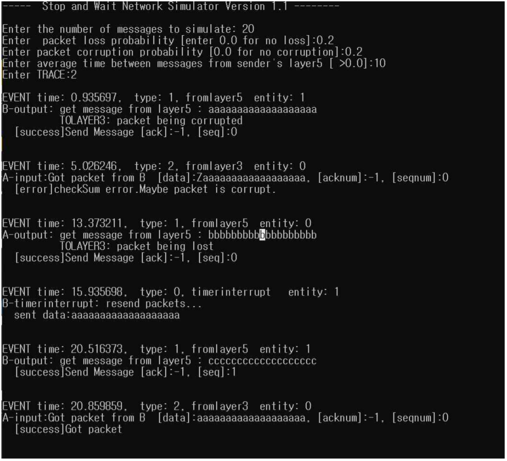
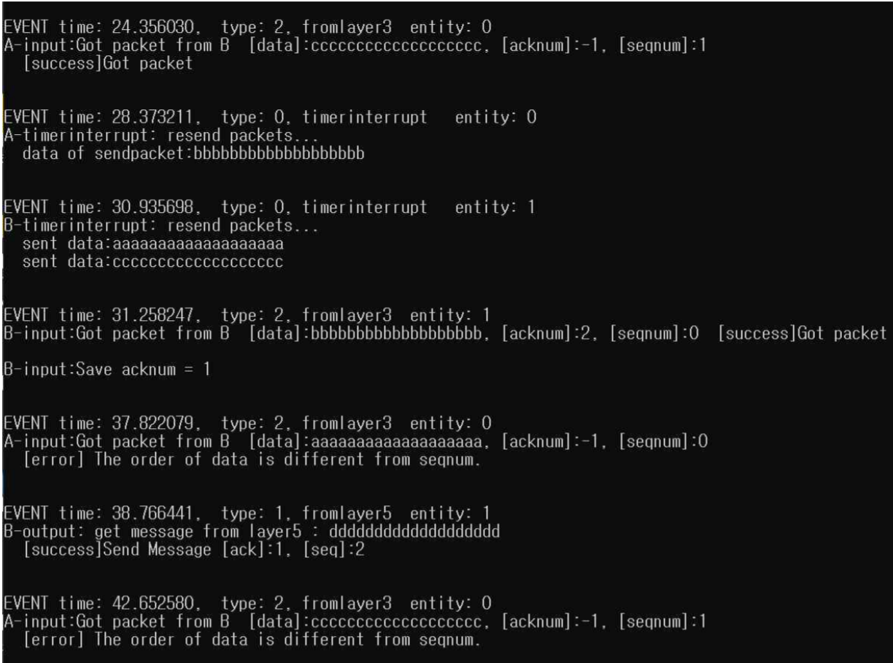

# bidirection go-back n in network-layer4(RDT 3.0방식) 구현

- rdt 3.0의 bidirectional GBN 방식의 전송방식을 구현하면서 어떻게 신뢰성을 보장하는지 알아보기

이 코드는 네트워크 프로그래밍 과목을 진행하면서 만든 코드이고 교재 Computer-Networking: A top down Approach Featuring the internet, Addison-wesley, 7thEd.에 나온 bidirection 구현 과제를 바탕으로 만들어진 코드이다.

테스트 환경은 window 10 visual studio 디버거를 통해 진행되었다.
CPU i7-8565U
16GB

## 개념

> TCP는 신뢰성을 보장하는 프로토콜

rdt 3.0 bidirection GBN 방식의 패킷전송을 통해 신뢰성을 보장하는 방식을 직접 확인한다.

구현 매커니즘은 다음과 같다.

1. stop-and-wait방식의 흐름제어를 먼저 구현해 신뢰성에 집중한다.
   - Receiver는 데이터를 제대로 받았다면 ack패킷을 보낸다.
   - Sender에서 ack패킷을 받으면 다음 데이터를 보낸다.
2. 파이프라이닝 기능을 추가한다.
   - 속도에 집중을한다.
   - 데이터를 누적하여 보내서 전송의 효율성을 높인다.

## 테스트방식

1. 전송패킷 수를 정한다.(아래의 테스트에선 20개)
2. 패킷 손실률을 정한다.(0.2정도가 적당하다)
3. 패킷 corruption을 정한다(이것도 0.2가 적당하다)
4. 패킷 전송이 되는 평균시간을 정한다.(10초를 줘서 적당한 간격을 주었다.)
5. TRACE는 디버깅을 위한 숫자이다. 본 테스트에선 2단계로 지정을 했다.

## 구현 결과에 대한 화면

A와 B에 보낼 패킷수는 20개로 설정, packet손실, 변형 확률을 둘다 0.2, 메세지가 들어오는 평균 간격을 10으로 해서 테스트(TRACE는 디버깅을 위한 값)

